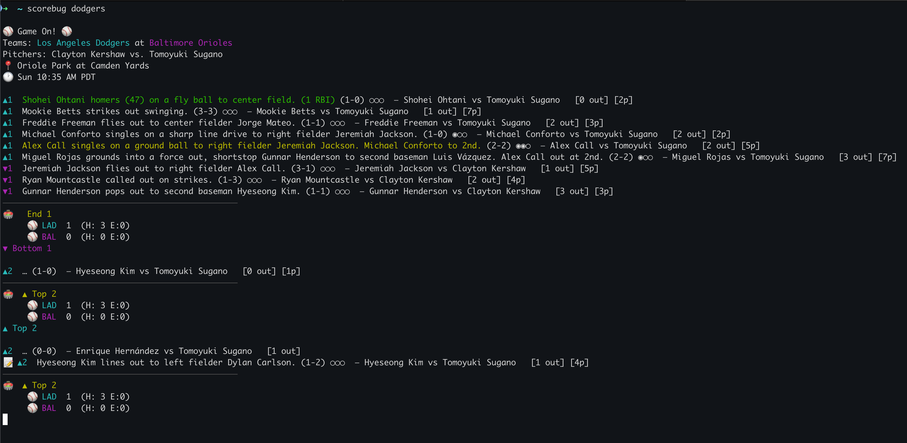

## Scorebug

Follow your favorite MLB teams with live play-by-play in the terminal. 



## Example Output

```
⚾ Game On! ⚾
Teams: Los Angeles Dodgers at Baltimore Orioles  
Pitchers: Clayton Kershaw vs. Tomoyuki Sugano
📍 Oriole Park at Camden Yards
🕐 Sun 10:35 AM PDT

▲1  Shohei Ohtani homers (47) on a fly ball to center field. (1 RBI) (1-0) ○○○
▲1  Mookie Betts strikes out swinging. (3-3) ○○○
────────────────────────────────────────────────
🏟️  ▲ Top 1
     ⚾ LAD  1  (H: 1 E:0)
     ⚾ BAL  0  (H: 0 E:0)
```

## Install

- From PyPI
  ```bash
  pip install scorebug
  ```

- Local checkout (editable)
  - Clone this repo
  - pip install -e .

Requires Python 3.9+.

## Usage

- Positional team or prompt

```bash
scorebug dodgers
# or just run `scorebug` and enter a team when prompted
```

- Specific game by gamePk

```bash
scorebug --gamepk 716910
```

- Show every pitch and start from the first at-bat

```bash
scorebug yankees --pitches --from-start
```

## What it does

- Finds today's game for a team (or uses --gamepk)
- Streams new at-bats and optionally every pitch
- Prints a compact scoreboard on change or inning transitions
- Highlights scoring plays
- If no game is live, prints the last final and the next scheduled game

## Outputs

- Uses team abbreviations in the scoreboard
- Shows ▲ for top and ▼ for bottom of the inning
- Reprints a play if its description updates
- Prints the scoreboard at start of halves and on End/Middle of innings
- Prints an inning banner on half-inning transitions for readability
- Colors: cyan for away, magenta for home, green for scoring plays
- Disable color with --no-color
- Includes ball-strike count and approximate pitch count per at-bat
- Shows base runners when available (◉ occupied, ○ empty)
- Pre-game shows probable pitchers and local start time
- If a team has multiple games today, you can select which one to follow

## CLI reference

- team: team id, abbr, or name (e.g., 119, LAD, Dodgers)
- `--team`: same as positional team
- `--date YYYY-MM-DD`: date to search (default: today in Los Angeles)
- `--gamepk`: MLB gamePk to stream directly
- `--interval`: poll seconds (default 2.5)
- `--pitches`: print each pitch
- `--from-start`: print all prior at-bats on first fetch
- `--no-color`: disable ANSI color
- `--scoring-only`: only print scoring plays and inning transitions
- `--opponent TEAM`: disambiguate doubleheaders by opponent (id, abbr, or name)
- `--log FILE`: append the live stream to a file
- `--dump FILE`: write full game log for the selected game and exit
- `--tz ZONE`: override local timezone (e.g., America/New_York)
- `--line-score`: print inning-by-inning linescore under the scoreboard
- `--box-interval N`: every N minutes, reprint the scoreboard even if unchanged
- `--quiet`: only scoreboard and inning banners
- `--verbose`: extra details (pitches and runners)

## Notes

- Data comes from MLB StatsAPI schedule and the v1.1 live feed
- Uses If-None-Match to avoid reprinting unchanged states
 - Team IDs are cached in `~/.scorebug/teams-<season>.json` to reduce API calls

## Config (optional)

Create `~/.scorebug/config.toml` to set defaults:

```toml
team = "Dodgers"          # default team
tz = "America/Los_Angeles" # IANA timezone
interval = 2.5             # poll seconds
no_color = false           # disable ANSI color
line_score = true          # show inning-by-inning line score
box_interval = 5           # minutes between forced scoreboard prints
```